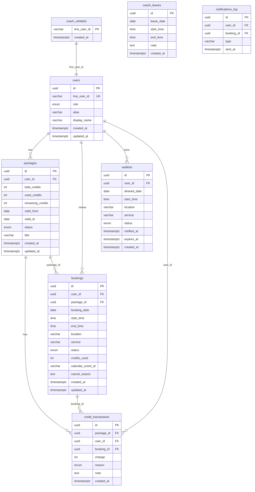

# ER Diagram

```mermaid
erDiagram
  users ||--o{ packages : has
  users ||--o{ bookings : makes
  users ||--o{ waitlists : joins
  users ||--o{ credit_transactions : "user_id"
  packages ||--o{ credit_transactions : has
  packages ||--o{ bookings : "package_id"
  bookings ||--o{ credit_transactions : "booking_id"
  coach_whitelist ||--|| users : "line_user_id"

  users {
    uuid id PK
    varchar line_user_id UK
    enum role
    varchar alias
    varchar display_name
    timestamptz created_at
    timestamptz updated_at
  }

  coach_whitelist {
    varchar line_user_id PK
    timestamptz created_at
  }

  packages {
    uuid id PK
    uuid user_id FK
    int total_credits
    int used_credits
    int remaining_credits
    date valid_from
    date valid_to
    enum status
    varchar title
    timestamptz created_at
    timestamptz updated_at
  }

  credit_transactions {
    uuid id PK
    uuid package_id FK
    uuid user_id FK
    uuid booking_id FK
    int change
    enum reason
    text note
    timestamptz created_at
  }

  coach_leaves {
    uuid id PK
    date leave_date
    time start_time
    time end_time
    text note
    timestamptz created_at
  }

  bookings {
    uuid id PK
    uuid user_id FK
    uuid package_id FK
    date booking_date
    time start_time
    time end_time
    varchar location
    varchar service
    enum status
    int credits_used
    varchar calendar_event_id
    text cancel_reason
    timestamptz created_at
    timestamptz updated_at
  }

  waitlists {
    uuid id PK
    uuid user_id FK
    date desired_date
    time start_time
    varchar location
    varchar service
    enum status
    timestamptz notified_at
    timestamptz expires_at
    timestamptz created_at
  }

  notifications_log {
    uuid id PK
    uuid user_id FK
    uuid booking_id FK
    varchar type
    timestamptz sent_at
  }
```
